# Recipes

Auf dieser Seite findest du alle **Crafting-Rezepte** des Buff-Systems.  
Jedes Rezept ist mit dem entsprechenden Item verlinkt – ein Klick auf den Namen bringt dich direkt zur **Detailseite mit Infos und Regeln** zu diesem Item.

---

## 🎟️ Buff- & System-Items

### Buff Tokens
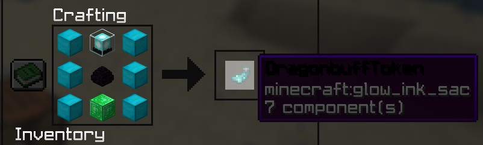

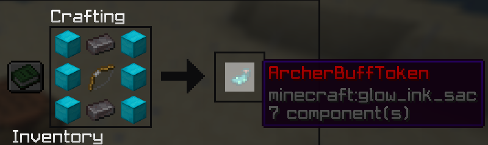
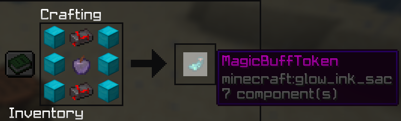
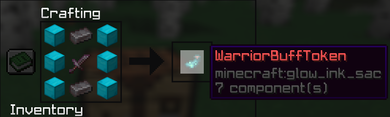
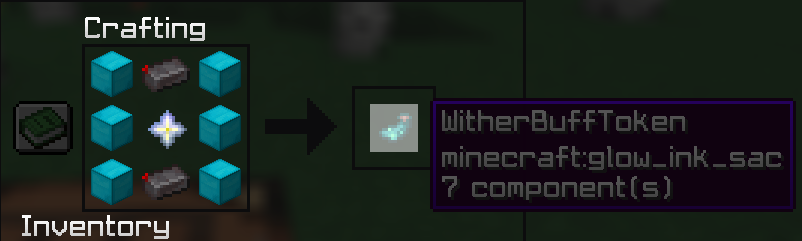
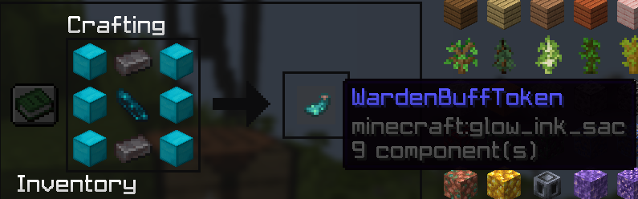
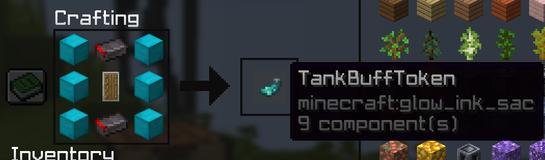
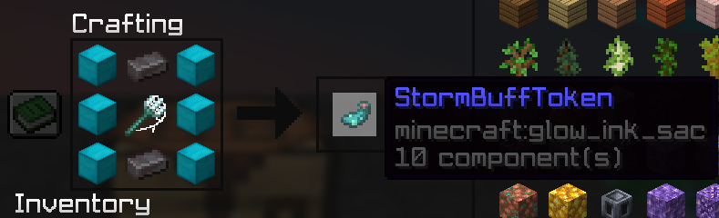
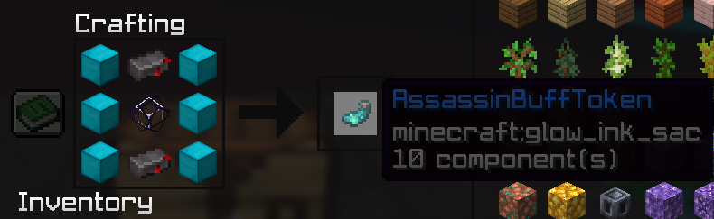
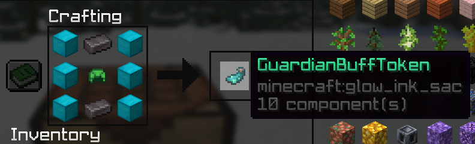
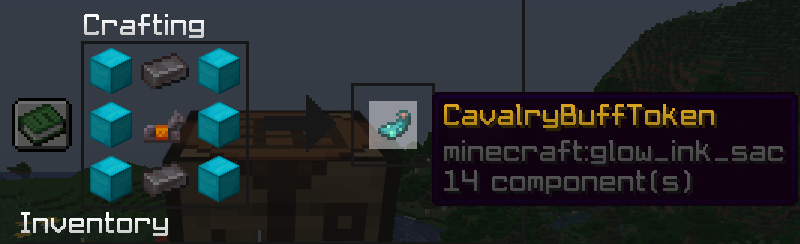
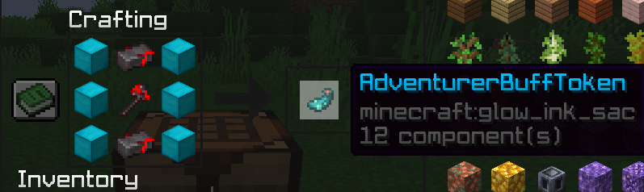

---

### Reroll Book

_Rezept:_
- Tauscht deinen buff zu einem zufälligen Buff
- Wechselt nicht zu boss und legendary buffs

---

## ⚔️ Kampf- & Utility-Items

### Goldener Apfel
➡️ **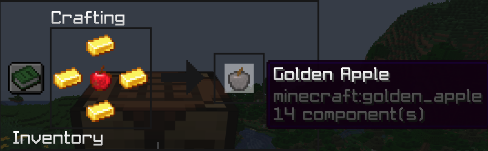**  
_Rezept:_
- Modifiziertes oder klassisches Rezept

---

### Cobwebs
➡️ **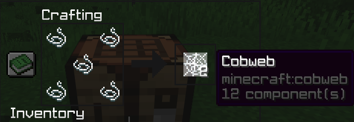**  
_Rezept:_
- Craftbar im Buff SMP
- Wird häufig in Control- & Trap-Mechaniken verwendet

---

## 🧩 Weitere Rezepte

- Zusätzliche Rezepte können durch Events, Updates oder Balancing ergänzt werden
- Änderungen an Rezepten werden hier dokumentiert
- Nicht jedes Item ist permanent craftbar

---

## ℹ️ Hinweise
- Alle Rezepte sind **server-spezifisch**
- Crafting kann sich durch Balancing ändern